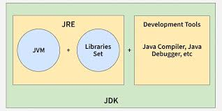

# JDK, JRE and JVM

## Java Development Kit (JDK)

- JDK stands for **Java Development Kit**
- It is required to **develop Java applications**
- JDK provides tools to:
    - Write Java programs
    - Compile source code
    - Package applications
    - Run and debug programs
- JDK contains:
    - JRE
    - Development tools such as:
        - `javac` – Java compiler
        - `java` – Program launcher
        - `javadoc` – Documentation generator
        - `jar` – Packaging tool
        - `jshell` – Java REPL (Java 9+)
- JDK is used by **developers**

---

## Java Runtime Environment (JRE)

- JRE stands for **Java Runtime Environment**
- It is required to **run Java applications**
- JRE provides the **runtime environment and support** required to execute Java programs
- JRE contains:
    - JVM
    - Core Java class libraries
    - Supporting files
- JRE does **not** contain development tools like compilers
- JRE is mainly used by **end users**(can be installed separately without JDK)

---

## Java Virtual Machine (JVM)

- JVM stands for **Java Virtual Machine**
- JVM is responsible for executing Java bytecode
- JVM provides **platform independence**
- JVM converts bytecode into machine-specific instructions
- JVM is **platform dependent**
- JVM manages:
    - Memory allocation
    - Garbage collection
    - Thread scheduling
    - Security checks
    - Exception handling

---

## Just-In-Time (JIT) Compiler

- JIT stands for **Just-In-Time Compiler**
- JIT is a part of the JVM
- JIT improves the performance of Java applications
- Frequently executed bytecode is compiled into **native machine code**
- Native code is executed directly by the CPU
- This reduces interpretation overhead and increases execution speed

---

## How Java Program Runs

1. Java source code (`.java`) is written by the developer
2. The compiler (`javac`) converts source code into bytecode (`.class`)
3. Bytecode is loaded into the JVM
4. JVM verifies the bytecode
5. JVM executes bytecode using:
    - Interpreter
    - JIT compiler (for optimized execution)

---

---

## Key Takeaways

- JDK is required to develop Java programs
- JRE is required to run Java programs
- JVM executes bytecode and manages runtime
- JIT compiler improves execution performance
- Platform independence is achieved using JVM

