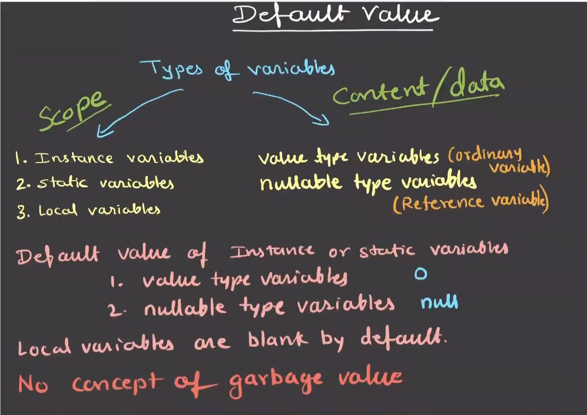

# Types of Variables in Java

## What is a Variable?

- A variable is a **named memory location**
- Used to store data during program execution
- The value of a variable can change during execution
- Java is a **statically typed** language, so the data type must be declared

---

## Classification of Variables in Java

Based on **scope**, **lifetime**, and **memory location**, variables are classified into:

1. Local Variables
2. Instance Variables
3. Static Variables

---

## 1. Local Variables

- Declared inside a **method**, **constructor**, or **block**
- Accessible **only within that block**
- Must be **explicitly initialized before use**
- Stored in **stack memory**
- **No default values are assigned by Java**
- Regardless of whether they are **primitive or reference types**, local variables contain a **blank / uninitialized state**

```java
void show() {
    int x = 10;   // local variable
    System.out.println(x);
}
```
---

## Important Points (Local Variables)

- Scope is limited to the **block** in which they are declared
- Memory is released when the **method execution ends**
- **Access modifiers** cannot be used
- Using an **uninitialized local variable** causes a **compile-time error**

---

## 2. Instance Variables

- Declared inside a **class**, but **outside methods**
- Belong to an **object**
- Each object has its **own copy**
- Stored in **heap memory**
- Automatically initialized with **default values**

```java
class Student {
    int rollNo;        // instance variable
    String name;       // instance variable
}
```
---
## Important Points (Instance Variables)

- Created when an **object is created**
- Destroyed when the object is **garbage collected**
- Can use access modifiers (`private`, `protected`, `public`)
- Get **default values automatically**

---

## 3. Static Variables (Class Variables)

- Declared using the `static` keyword
- Belong to the **class**, not to objects
- Only **one copy** exists
- Shared among **all objects**
- Stored in the **method area**
- Initialized when the **class is loaded**

```java
class College {
    static String collegeName = "ABC College";
}
```
---


---
## Important Points (Static Variables)

- Accessed using the **class name**
- **Memory-efficient** due to a single shared copy
- Used for **constants**, **counters**, and **shared configuration**

---

## Default Values of Variables

| Data Type       | Local Variable       | Instance Variable | Static Variable |
| --------------- | -------------------- | ----------------- | --------------- |
| byte            | ❌ No default (blank) | `0`               | `0`             |
| short           | ❌ No default (blank) | `0`               | `0`             |
| int             | ❌ No default (blank) | `0`               | `0`             |
| long            | ❌ No default (blank) | `0L`              | `0L`            |
| float           | ❌ No default (blank) | `0.0f`            | `0.0f`          |
| double          | ❌ No default (blank) | `0.0`             | `0.0`           |
| char            | ❌ No default (blank) | `'\u0000'`        | `'\u0000'`      |
| boolean         | ❌ No default (blank) | `false`           | `false`         |
| Reference types | ❌ No default (blank) | `null`            | `null`          |

⚠️ Local variables **never receive default values**, irrespective of being primitive or reference types.

---

## Comparison of Variable Types

| Feature       | Local          | Instance       | Static      |
| ------------- | -------------- | -------------- | ----------- |
| Scope         | Block          | Object-level   | Class-level |
| Memory        | Stack          | Heap           | Method Area |
| Default Value | ❌ Not provided | ✅ Provided     | ✅ Provided  |
| Belongs to    | Method/Block   | Object         | Class       |
| Copies        | Multiple       | One per object | Only one    |

---

