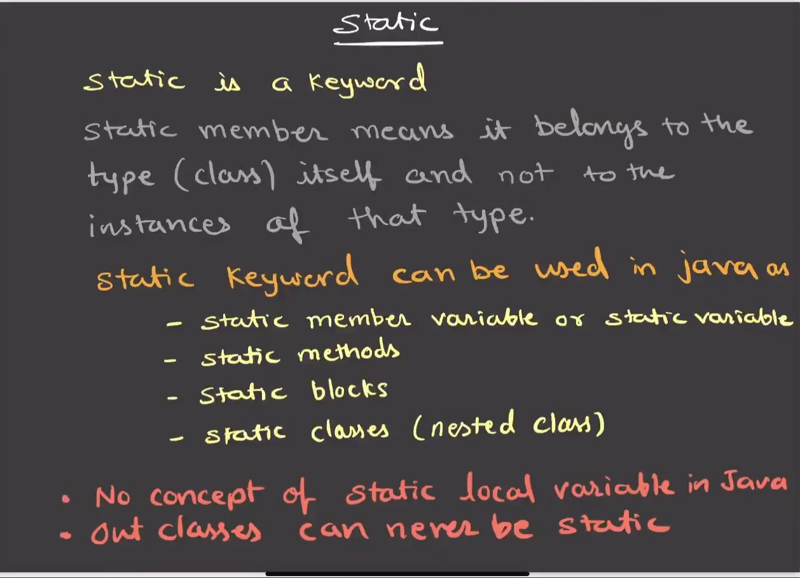

# static Keyword in Java

## What is `static`?

- `static` is a **keyword** in Java
- It is used to create **class-level members**
- Static members belong to the **class**, not to individual objects
- Only **one copy** of a static member exists in memory, shared by all objects

---



---
## Why `static` is Needed?

- To represent data or behavior that is **common to all objects**
- To save memory by avoiding duplicate copies
- To allow access **without creating an object**
- To support utility-style programming

---

## static and Memory

- Static members are stored in the **Method Area**
- They are loaded when the **class is loaded**
- They exist **before any object is created**
- Memory is released only when the **class is unloaded**

---

## Static Variables (Class Variables)

- Declared using the `static` keyword
- Belong to the **class**
- Shared among all objects
- Initialized **only once**

```java
class College {
    static String collegeName = "ABC College";
}
```

## Accessing Static Variables

```java
System.out.println(College.collegeName);
```
## Important Points (Static Variables)

- All objects see the **same value**
- Changing the value affects **all objects**
- Used for **constants**, **counters**, and **shared configuration**

---

## Static Methods

- Can be called **without creating an object**
- Belong to the **class**
- Can access:
    - **Static variables**
    - **Other static methods**
- Cannot directly access:
    - **Instance variables**
    - **Instance methods**
- Cannot use `this` or `super`

```java
class MathUtil {
    static int add(int a, int b) {
        return a + b;
    }
}
```
```java
int result = MathUtil.add(10, 20);
```
---

## Why `main` Method is static?
```java
public static void main(String[] args)
```
- The JVM needs to call the `main` method **without creating an object**
- If `main` were **non-static**, the JVM would first need to create an object of the class
- Hence, the `main` method must be **static**

---

## Static Block

- Used to **initialize static variables**
- Executes **only once**
- Runs when the **class is loaded**
- Executes **before the `main` method**

```java
class Test {
    static int x;

    static {
        x = 100;
        System.out.println("Static block executed");
    }

    public static void main(String[] args) {
        System.out.println(x);
    }
}
```

---
## Instance Block vs Static Block

| Feature     | Instance Block     | Static Block     |
| ----------- | ------------------ | ---------------- |
| Executes    | On object creation | On class loading |
| Frequency   | Every object       | Only once        |
| Used for    | Instance variables | Static variables |
| Runs before | Constructor        | main method      |

---
## static with Classes (Static Nested Class)

## Static Nested Class

- A class declared inside another class using the `static` keyword
- Does **not require** an object of the outer class
- The **outer class can never be static**, only the **nested class** can be static


```java
class Outer {
    static class Inner {
        void show() {
            System.out.println("Static nested class");
        }
    }
}
```
---
## static and Method Hiding

- Static methods are **not overridden**
- They are **hidden**, not overridden
- Method resolution happens at **compile time**
- Method selection depends on the **reference type**, not the object type

### Example

```java
class A {
    static void show() {
        System.out.println("A");
    }
}

class B extends A {
    static void show() {
        System.out.println("B");
    }
}
```
---
## static vs Instance Members

| Feature     | Static      | Instance         |
| ----------- | ----------- | ---------------- |
| Belongs to  | Class       | Object           |
| Copies      | One         | One per object   |
| Memory      | Method Area | Heap             |
| Access      | Class name  | Object reference |
| Uses `this` | ❌ No        | ✅ Yes            |

---

## Common Use Cases of `static`

- Utility classes (`Math`, `Arrays`, `Collections`)
- Constants (`public static final`)
- Shared counters
- Configuration values
- Entry point of a Java program (`main` method)

---

## Important Points

- `static` members are resolved at **compile time**
- Static methods **cannot be overridden**
- Static variables improve **memory efficiency**
- Static blocks execute **before constructors**

---
## Access Rules for static Members

- An **object** can access **static members** of the class
- A **static method** cannot directly use **instance variables**
- This is because instance variables belong to objects, while static methods belong to the class
