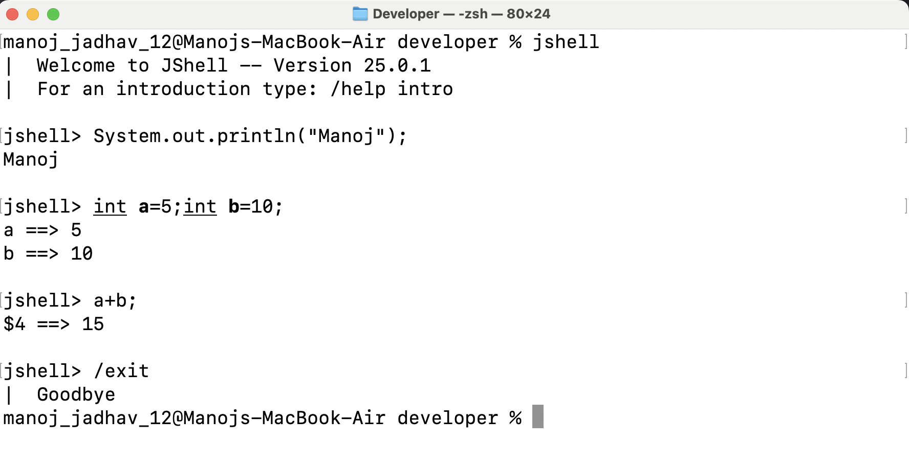

# Variables in Java

## What is a Variable?

- A variable is a **named identifier** used to represent a **memory location** where program data is stored
- Java is a **statically typed programming language**, the **data type must be specified** during variable declaration

---

## Declaring a Variable

- Syntax:

```java
dataType variableName;
```
- Example:
```java
int age;
```

## Initializing a Variable

- Assigning a value to a variable is called **initialization**

```java
int age = 25;
```
---
## Types of Variables in Java

### 1. Local Variables

- Declared inside a **method**, **constructor**, or **block**
- Accessible only within that block
- Must be initialized before use

```java
void show() {
    int x = 10;
}
```
### 2. Instance Variables

- Declared inside a class but **outside methods**
- Belong to an object
- Each object has its own copy

```java
class Student {
    int rollNo;
}
```

### 3. Static Variables

- Declared using the `static` keyword
- Belong to the **class**
- Shared among all objects of the class

```java
class College {
    static String name = "ABC College";
}
```

---
## Rules for Naming Variables

- Must start with a **letter**, `_`, or `$`
- Cannot start with a number
- Cannot use Java **keywords**
- Case-sensitive
- Should follow **camelCase** naming convention

---

## Valid Variable Names

```java
age
totalMarks
studentName
```
## Invalid Variable Names
```java
2count
class
total-marks
```
---
## Important Points

- Variables must be declared before use
- Java is a **statically typed** language
- Data type of a variable cannot be changed once declared

---

# Comments in Java

## What are Comments?

- Comments are used to **explain code**
- They are **ignored by the compiler**
- Used to improve **readability and understanding**

---

## Types of Comments in Java

### 1. Single-line Comment

- Used for short explanations
- Written using `//`

```java
// This is a single-line comment
int a = 10;
```
### 2. Multi-line Comment

- Used for longer explanations
- Written using `/* */`

```java
/*
This is a
multi-line comment
*/
int b = 20;
```

### 3. Documentation Comment

- Used to generate documentation
- Written using `/** */`
- Used by the `javadoc` tool

```java
/**
 * This method prints a message
 */
public void show() {
    System.out.println("Hello");
}
```
## Important Points

- Comments do not affect program execution
- Documentation comments are used for API documentation
- Good comments improve code maintainability

---
# Constants/ Literals

Constants or literals are **data** used for representing fixed values

## Constants in Java

- A constant is a variable whose value **cannot be changed**
- Constants are declared using the `final` keyword
- Once assigned, the value of a constant remains fixed

---

## Declaring a Constant

- Syntax:

```java
final dataType CONSTANT_NAME = value;
```
- Example:
```java
final int MAX_AGE = 60;
final double PI = 3.14;
```
## Naming Convention for Constants

- Constants are usually written in **UPPER_SNAKE_CASE**
- Words are separated using underscores (`_`)

```java
final int MAX_SIZE = 100;
final String COMPANY_NAME = "ABC Corp";
```
## Important Points about Constants

- `final` keyword is mandatory
- Constants must be initialized at the time of declaration
- Constants improve code safety and readability
## Literals in Java

- A literal is a **fixed value** assigned to a variable
- Literals represent **constant values** directly in the code

# Types of literals in Java

## 1. Integer literals
- Decimal literals(Base 10)
- Octal literals(Base 8)
- Hexadecimal literals(Base 16)
- Binary literals(Base 2)
- Example: 
  ```java
  int a = 10;       // decimal
  int b = 0b1010;   // binary
  int c = 012;      // octal
  int d = 0xA;      // hexadecimal
   ```
### 2. Floating-Point Literals

```java
float x = 10.5f;
double y = 20.75;
```
### 3. Character Literals
```java
char ch = 'A';
char digit = '7';
```
### 4. String Literals
```java
String name = "Java";
String message = "Hello World";
``` 

### 5. Boolean Literals
```java
boolean isValid = true;
boolean isEmpty = false;
```
### 6. Null Literal
```java
String str = null;
```
## Difference Between Constants and Literals

| Constants | Literals |
|----------|----------|
| Use `final` keyword | Fixed values in code |
| Value cannot change | Value itself is the data |
| Has a variable name | No variable name |

---
# Keywords in Java

## What are Keywords?

- Keywords are **reserved words** in Java
- They have **predefined meanings**
- Keywords **cannot be used** as variable, method, or class names

---

## List of Java Keywords

```text
abstract    assert      boolean     break       byte
case        catch       char        class       const*
continue    default     do          double      else
enum        extends     final       finally     float
for         goto*       if          implements  import
instanceof int         interface   long        native
new         package     private     protected   public
return      short       static      strictfp    super
switch      synchronized this       throw       throws
transient  try          void        volatile    while
```
- `const` and `goto` are **reserved keywords** in Java but are **not used**
- They are **reserved for future use** and effectively **removed from active usage**
- These keywords cannot be used as identifiers

## Important Points

- Keywords are **case-sensitive**
- All keywords are written in **lowercase**
- Total keywords in Java: **50**
- `true`, `false`, and `null` are **technically keywords** which are **predefined** inside the compiler
- They are often referred to as **literals** because:
    - They represent actual data values
    - They can be **assigned to variables**
- They are highlighted differently since they behave as **data/literal values**, not like regular keywords

---
# Escape Sequences in Java

## What are Escape Sequences?

- Escape sequences are **special character combinations**
- They begin with a **backslash (`\`)**
- Used to represent characters that cannot be typed directly
- Commonly used inside **string and character literals**

---

## Common Escape Sequences

| Escape Sequence | Meaning |
|-----------------|---------|
| `\n` | New line |
| `\t` | Horizontal tab |
| `\b` | Backspace |
| `\r` | Carriage return |
| `\f` | Form feed |
| `\\` | Backslash |
| `\'` | Single quote |
| `\"` | Double quote |

---

## Examples

```java
System.out.println("Hello\nWorld");
System.out.println("Java\tProgramming");
System.out.println("She said: \"Hello\"");
System.out.println("Path: C:\\Java\\bin");
```
### Character Literal Example
```java
char newline = '\n';
char tab = '\t';
```
## Important Points

- Escape sequences are interpreted by the **compiler**
- They are used only inside **string** and **character literals**
- Each escape sequence represents a **single character**
---
# JShell in Java

## What is JShell?

- JShell stands for **Java Shell**
- It is an **interactive command-line tool (REPL)**  
  *(Read–Eval–Print Loop)*
- Introduced in **Java 9**
- Used to execute Java code **without creating a class or main method**

---
## JShell Screenshot



## Why JShell is Used

- Quickly test Java statements
- Learn and experiment with Java features
- Useful for beginners and quick debugging


---
## Key Takeaways

- Variables store data in memory
- Java supports local, instance, and static variables
- Proper naming improves code readability
- Data type defines the kind of data a variable can hold
- Java supports single-line, multi-line, and documentation comments
- final keyword is used to create constants 
- Java supports multiple types of literals


