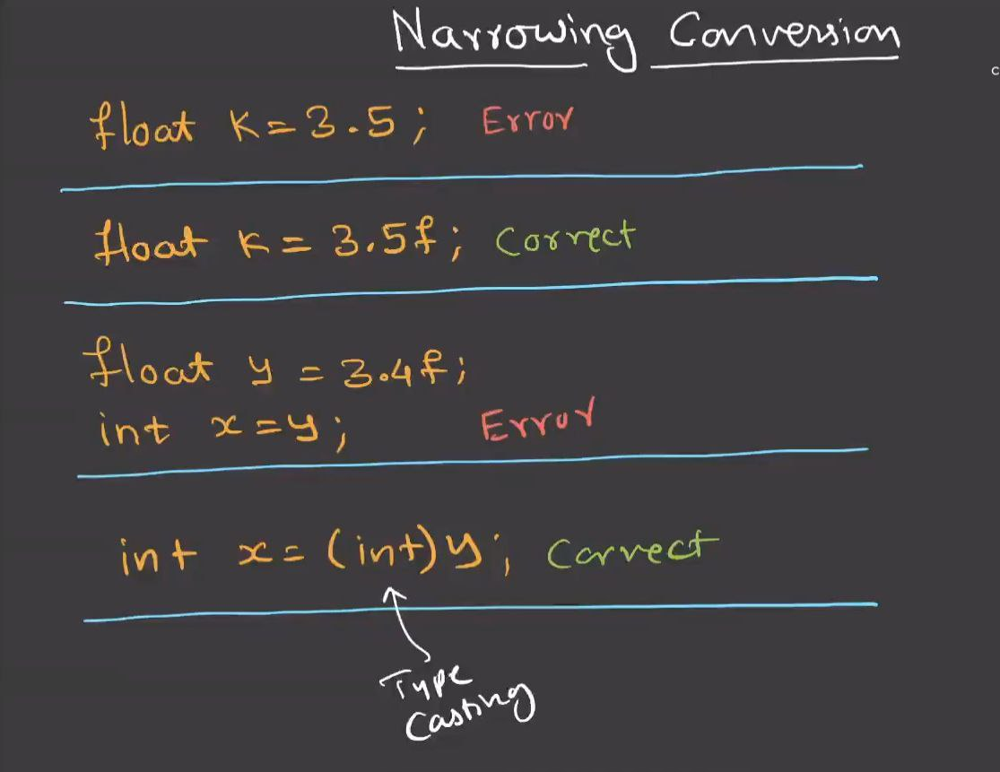
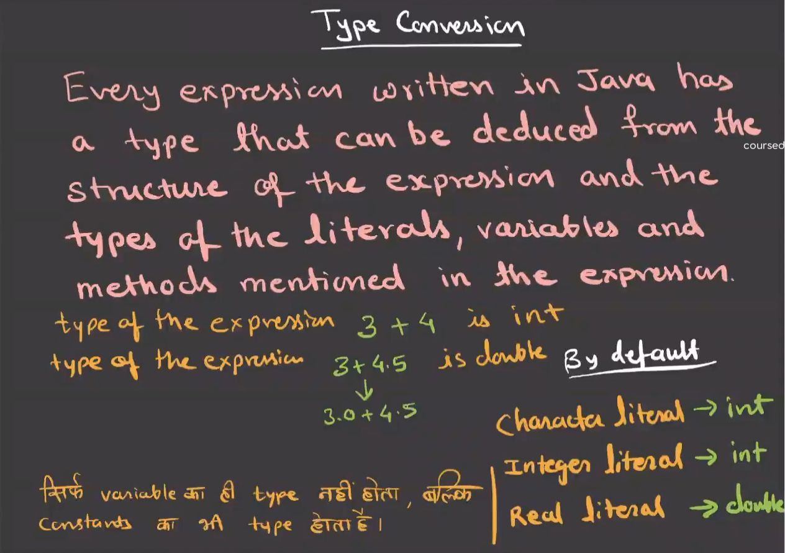
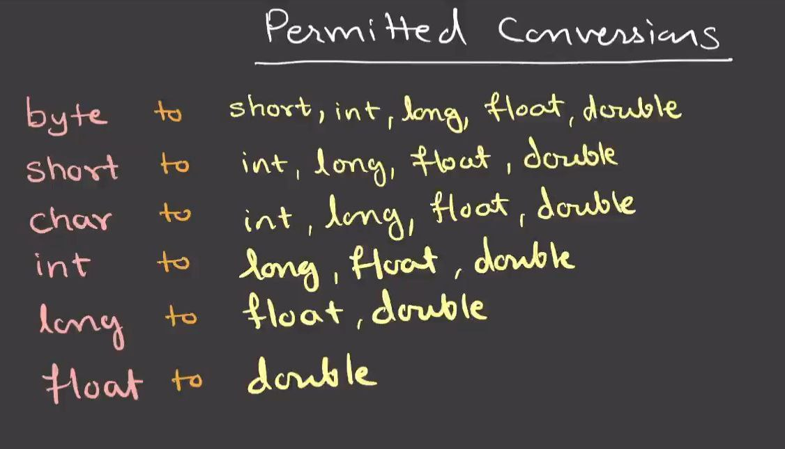

# Type Conversion in Java

## What is Type Conversion?

- Type conversion is the process of converting one **data type** into another
- It is mainly used when assigning a value of one type to a variable of another type

---

## Types of Type Conversion in Java

Java supports two types of type conversion:

- **Implicit Type Conversion (Widening)**
- **Explicit Type Conversion (Narrowing)**

---

## 1. Implicit Type Conversion (Widening)

- Conversion is done **automatically by the compiler**
- Happens when a **smaller data type** is converted to a **larger data type**
- No data loss occurs

**Order:**
```text
byte → short → int → long → float → double
```
- Example:
```java
int a = 10;
double b = a;
```

## 2. Explicit Type Conversion (Narrowing)

- Conversion is done **manually by the programmer**
- Happens when a **larger data type** is converted to a **smaller data type**
- **Data loss may occur**
- Also called **type casting**

---

### Syntax

```java
(dataType) value;
```
- Example:
```java
double x = 10.75;
int y = (int) x;
```
```java
long l = 100;
int i = (int) l;
```



## Important Points

- Implicit type conversion is **safe**
- Explicit type conversion may cause **data loss**
- `boolean` type **cannot be type cast** to or from other data types
- Type conversion works only between **compatible data types**



---


